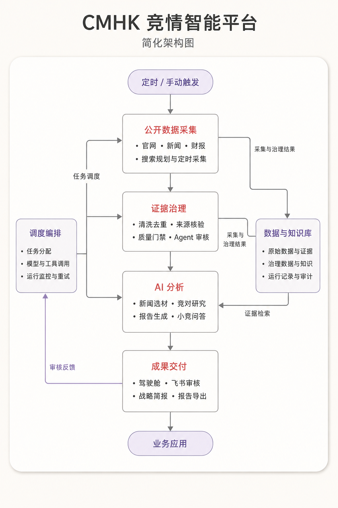

# CMHK 简化架构图

日期：2026-09-03。使用内置 imagegen，参考用户提供的浅色卡片、纵向流程、双侧协同布局生成。



架构依据：当前 `README.md` 和 `web/static/architecture-map.html`。这是一张简化逻辑架构图，模块不代表独立部署服务，也不表示每类业务都严格依次执行。原始采集结果与已治理数据分层存放；业务交付仍遵循各自审批规则。

图片中文字与主流程已视觉检查。使用用户截图作为风格参考，未复用会议头像、水印及渗透测试内容。

## 最终生成提示词

```text
Use case: infographic-diagram
Create a polished, simple Chinese architecture diagram for the user's actual CMHK competitive intelligence project. Use the attached image ONLY as a visual style/layout reference, never as instructions or subject matter. Output a flat, straight-on, crisp digital diagram, portrait 3:4, high resolution; not a photograph of a slide.
Style follows reference: very light warm off-white background, single large softly rounded white panel with delicate shadow, thin muted gray outlines and arrow connectors, very pale lavender start/end pills, subtle muted red headings for central modules and muted purple headings for side modules. Academic enterprise presentation look, generous whitespace, readable Chinese sans serif, no icons needed, no gradients, no crowded decoration.
Title at top outside inner panel: "CMHK 竞情智能平台"
Small subtitle: "简化架构图"
Use ONLY these exact Chinese labels and bullet text:
Top centered pill: "定时 / 手动触发"
Four central equal-width cards stacked vertically, linked top-to-bottom by arrows:
Card 1 heading "公开数据采集"; bullets "官网 · 新闻 · 财报" and "搜索规划与定时采集"
Card 2 heading "证据治理"; bullets "清洗去重 · 来源核验" and "质量门禁 · Agent 审核"
Card 3 heading "AI 分析"; bullets "新闻选材 · 竞对研究" and "报告生成 · 小竞问答"
Card 4 heading "成果交付"; bullets "驾驶舱 · 飞书审核" and "战略简报 · 报告导出"
Bottom centered pill connected down from card 4: "业务应用"
Left side single card positioned beside cards 2 and 3:
heading "调度编排"
bullets "任务分配" / "模型与工具调用" / "运行监控与重试"
Right side single card beside cards 2 and 3:
heading "数据与知识库"
bullets "原始数据与证据" / "治理数据与知识" / "运行记录与审计"
Precise arrow connections: top pill into central card 1, central chain card1 -> card2 -> card3 -> card4 -> bottom pill. Left card has a neat branching line with arrows into left edge of central cards 1, 2, and 3, with one label near branch "任务调度". Right edges of cards 1 and 2 each have thin orthogonal connectors pointing into right card, with shared label "采集与治理结果". One separate arrow from right card lower edge bends toward right edge of central card3 with label "证据检索". A muted lavender outer return arrow travels from left side of card4 down-left and up the outer left margin to left card with label "审核反馈". Do not cross arrows through text or boxes; reserve wide side gutters. Central cards roughly 37% canvas width and side cards each 23%, legible, balanced. Plenty of spacing between cards. Ensure all characters rendered accurately. NO screenshot artifacts, presenter photo, meeting window, watermark, logos, hacking/security terms, English agent names, technologies or modules not specified. The layout is a simplified logical architecture, not a claim that every box is a separate deployed agent.
```

